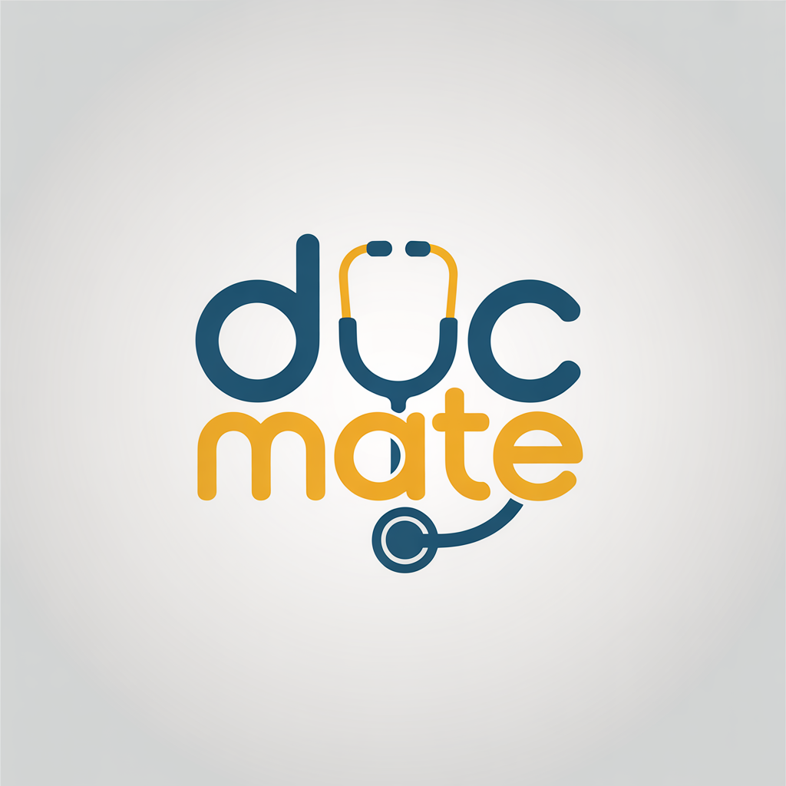
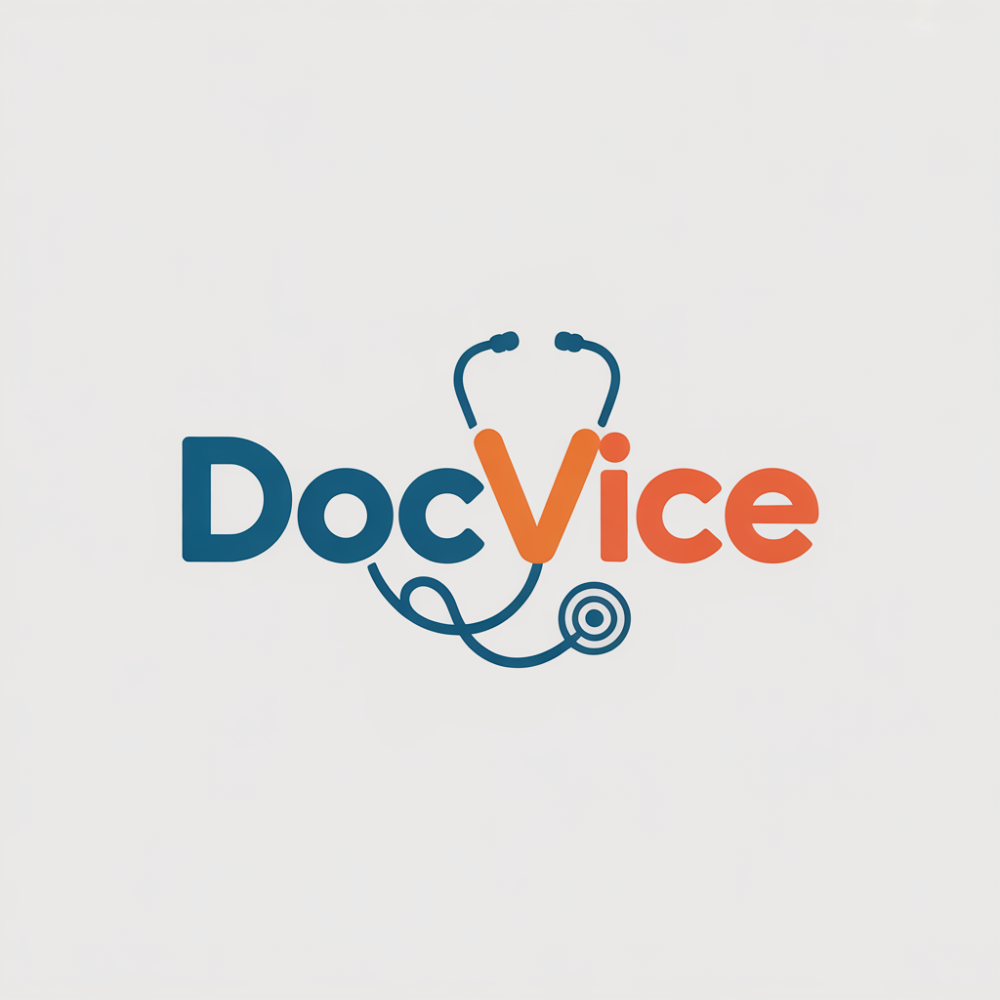
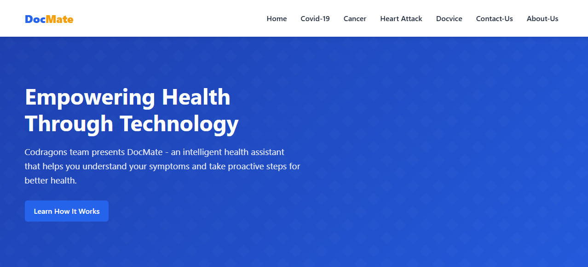
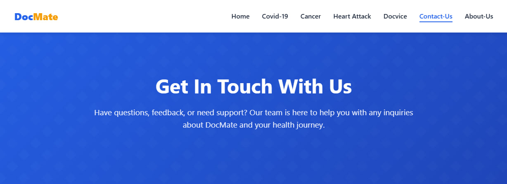
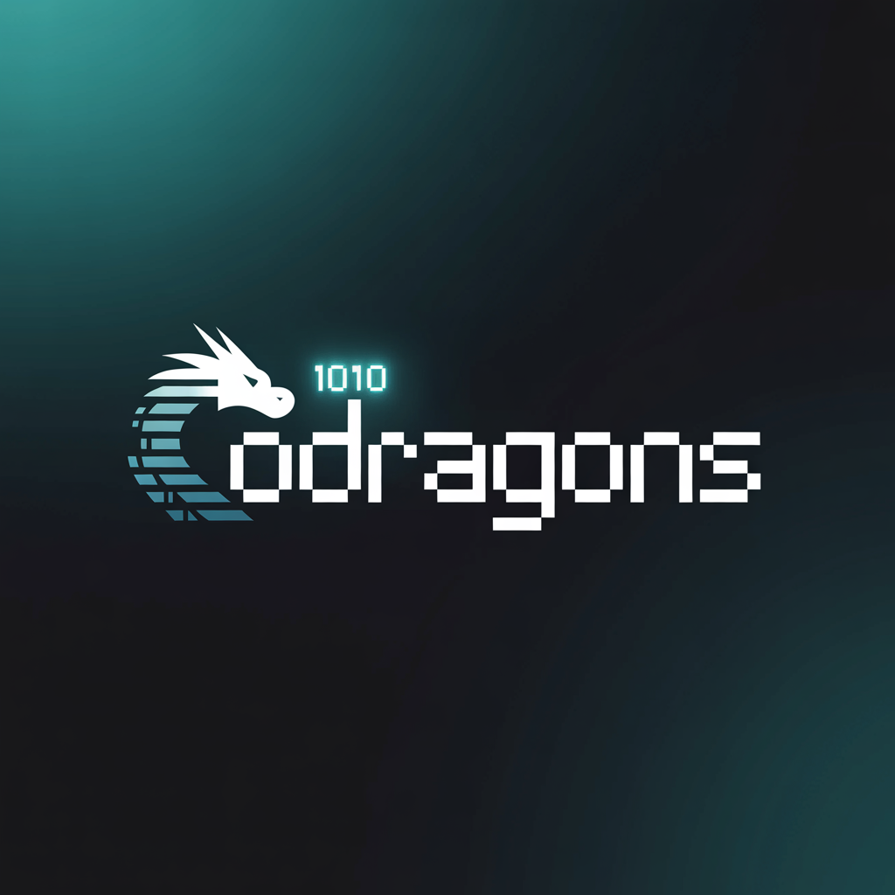

# DocMate & DocVice – Intelligent Healthcare Platforms  

## 📌 Overview  
**DocMate** and **DocVice** are intelligent healthcare platforms developed by **Team Codragons** as part of our graduation project. The goal is to make healthcare **more accessible, reliable, and data-driven**, empowering individuals to take charge of their health through assessment and education.  

- **DocMate** → Predicts early risks of serious diseases based on user-reported symptoms and guides users toward timely medical consultation.  
- **DocVice** → Provides verified health education, combats misinformation, and offers actionable prevention strategies.  

---

## 🚀 Features  

### 🔹 DocMate – Intelligent Health Assessment  
- Predicts risks of life-threatening diseases (e.g., cancer, COVID-19, chronic illnesses).  
- Uses symptom-based data to generate risk insights.  
- Encourages timely medical consultation for critical cases.  

### 🔹 DocVice – Trusted Health Education  
- Simplifies complex medical concepts into easy-to-understand content.  
- Provides verified and reliable information to combat misinformation.  
- Offers prevention strategies to reduce health risks.  
- Helps reduce patient anxiety by promoting awareness and control.  

---

## 🎯 Why These Platforms?  

### DocMate  
1. **Late Diagnoses Cost Lives** – Subtle early symptoms are often ignored, leading to late detection.  
2. **Accessibility** – Many people lack access to doctors for minor concerns; DocMate helps prioritize urgent cases.  

### DocVice  
1. **Fights Misinformation** – A large portion of online health content is inaccurate; DocVice provides verified knowledge.  
2. **Saves Time** – Summarizes hours of medical research into digestible formats.  
3. **Empowers Users** – Educated patients feel more confident and proactive in managing their health.  

---

## 📸 Screenshots
### 🖼️ Logos

*Official logo of DocMate platform.*  

  
*Official logo of DocVice platform.*  

### 📄 About Us Page  

(images/About_Us_sec2.jpg)

(images/About_Us_sec3.jpg)

(images/About_Us_sec4.jpg)

(images/About_Us_sec5.jpg)

*Section introducing our mission and vision for transforming healthcare.*  

### 📞 Contact Us Page  

(images/Contact_Us_sec2.jpg)

(images/Contact_Us_sec3.jpg)

*Page providing users with ways to reach the team for support or inquiries.*  

---

## 👨‍💻 Team Codragons  
### 🖼️ Team Logo

- **Frontend Specialists (4)** – Designed and developed the user interface for seamless user experience.  
- **Backend Specialists (2)** – Built APIs, managed datasets, and integrated data-driven features.  

*(I worked as a **Backend Specialist**, contributing to database management, risk analysis logic, and feature integration.)*  

---

## 🛠️ Tech Stack  
- **Frontend:** React.js, HTML, CSS, JavaScript  
- **Backend:** Node.js, Express.js  
- **Database:** MySQL / SQL (depending on implementation)  
- **Other Tools:** Git, GitHub  

---

## 📖 How It Works  

1. **DocMate**  
   - Users input symptoms.  
   - System analyzes patterns against medical datasets.  
   - Provides risk insights and recommendations.  

2. **DocVice**  
   - Users access health topics in simple language.  
   - Verified medical content is provided.  
   - Preventive strategies and educational resources are shared.  

---

## 🌍 Impact  
Together, **DocMate** and **DocVice** aim to:  
- Reduce preventable late diagnoses.  
- Make medical guidance accessible to underserved communities.  
- Build trust through verified, easy-to-digest health education.  

---

## 📩 Contact  
For inquiries or collaboration opportunities:  
**Sofyan Kirat** – Backend Specialist  
📧 [www.sofyankirat@gmail.com](mailto:www.sofyankirat@gmail.com)  
